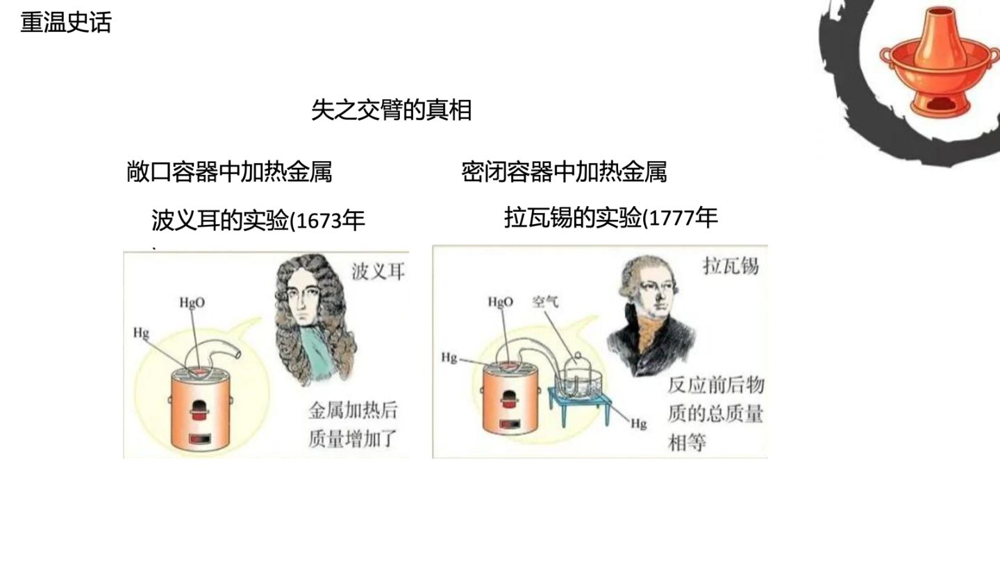
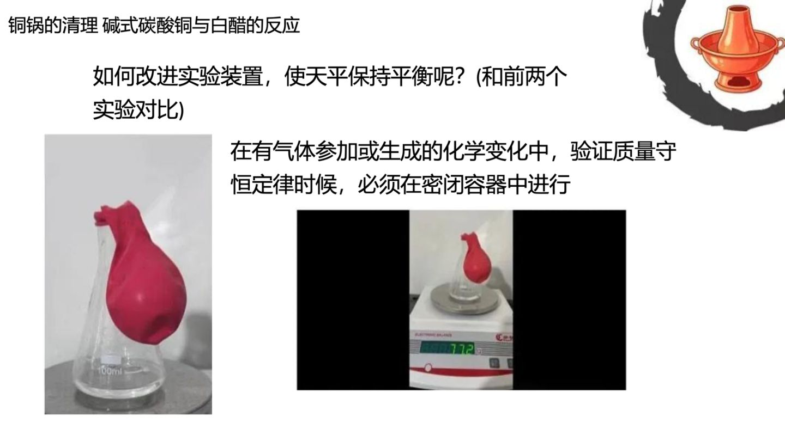
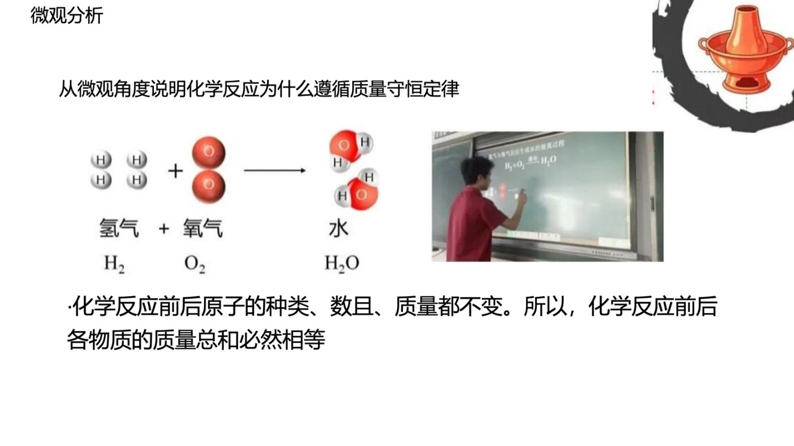

# PNG2PPT / minerU-to-ppt

> 把纯图片课件(PNG) / MinerU 解析结果转成可编辑的 PowerPoint 演示文稿


## 📚 必读文档

| 文件 | 内容 | 何时读 |
|------|------|--------|
| **[docs/SCHEME.md](./docs/SCHEME.md)** | 完整方案 + 落地状态 | 开始前 |
| **[docs/RESEARCH.md](./docs/RESEARCH.md)** | 4 个开源项目调研对比 | 想了解选型理由时 |
| **[docs/RUNBOOK.md](./docs/RUNBOOK.md)** | 一步步操作手册 | 开始落地时 |

## 📁 目录结构

```
PNG2PPT/
├── README.md           ← 本文件(目录索引)
├── docs/               ← 全部文档
│   ├── SCHEME.md       ← 完整方案
│   ├── RESEARCH.md     ← 联网调研记录
│   ├── RUNBOOK.md      ← 落地手册
│   ├── REAL_TEST_RESULTS.md  ← 真实课件测试报告
│   └── TEST_RESULTS.md ← 综合测试结果
├── LICENSE             ← MIT
├── requirements.txt    ← Python 依赖
├── font_estimator.py   ← 字号估算工具(纯逻辑)
├── image_detector_v2.py← 图像检测(active, v1 已删)
├── mineru2pptx.py      ← MinerU → PPT 主流程
├── px2pptx_batch.py    ← px-image2pptx 批处理封装
├── px2pptx.sh          ← 一键启动脚本
├── gui.py              ← 简单 Tkinter GUI(可选)
├── tests/              ← 单元测试 (pytest)
│   ├── test_font_estimator.py
│   ├── test_image_detector_v2.py
│   └── test_mineru2pptx.py
├── .github/workflows/ci.yml  ← CI (ruff + pytest, 3 个 Python 版本)
└── px-image2pptx/      ← 上游依赖,需 `git clone` 获取(见下方)
    ├── px_image2pptx/  ← 核心代码
    ├── examples/       ← 自带示例图
    ├── tests/
    └── README.md
```

## 🚀 快速开始

```bash
# 0. Clone 仓库 + submodule(px-image2pptx 是子模块)
git clone --recurse-submodules https://github.com/sckall/image-to-ppt.git
cd image-to-ppt
# 如果已经 clone 了没带 --recurse-submodules, 补救:
# git submodule update --init --recursive

# 1. 安装
cd px-image2pptx
pip install -e ".[all]"
cd ..

# 2. 跑一张示例
mkdir -p tests_local
cp px-image2pptx/examples/image_good1_input.png tests_local/test1.png
px-image2pptx tests_local/test1.png -o tests_local/test1.pptx --lang en
```

## 🖥️ 多种使用方式

```bash
# 方式 1: 批处理 (推荐, 模型只加载一次)
python3 px2pptx_batch.py tests_local/ tests_local_out/ --lang ch

# 方式 2: 单文件 shell 脚本
./px2pptx.sh tests_local/test1.png

# 方式 3: GUI (无需命令行, 弹窗选文件)
python3 gui.py

# 方式 4: MinerU JSON → PPT
python3 mineru2pptx.py <img_dir> <mineru_output_dir> out.pptx [--snap] [--slide-width 13.333]

# 跑测试
pytest tests/ -v

# lint
ruff check .
```

## 📂 真实测试案例

测试文件:`mp.weixin.qq.com-课件分享质量守恒定律.pdf` (15 页化学课件, 本地路径已脱敏)

结果存放在 `tests_local/real_pptx_mobile/` (15 个 .pptx,总 13MB)

**详情见 [docs/REAL_TEST_RESULTS.md](./docs/REAL_TEST_RESULTS.md)**

## 🖼️ 示例输出 (Sample Output)

下面 3 张是上面 15 页化学课件中 3 页的可编辑 PPT 输出截图（mobile 模型, 实际打开 .pptx 看到的视觉效果）：

### Slide 1 — 重温史话：波义耳/拉瓦锡实验对比
> 散口容器中加热金属 vs 密闭容器中加热金属
> 一个质量增加, 一个总质量相等



### Slide 2 — 铜锅的清理：碱式碳酸铜与白醋的反应
> 气球套在锥形瓶上, 验证质量守恒定律必须在密闭容器中进行



### Slide 3 — 微观分析：H₂ + O₂ → H₂O
> 化学反应前后原子的种类、数目、质量都不变, 所以各物质质量总和必然相等



**关键看得出**：
- 文字层是**可编辑**的（点中"波义耳的实验(1673年)"这行, 可以单独改字、字号、颜色）
- 背景图保留原图（包括右上角的🔥铜锅图标）
- 字号还原肉眼无差（标题 ~28pt, 正文 ~18pt）
- 化学式 (H₂ / O₂ / H₂O) 位置精准, 没被 OCR 拆散

## 🎯 当前进度

- ✅ 联网调研完成 (4 个开源项目对比)
- ✅ 选定 px-image2pptx 方案
- ✅ git clone 仓库到本地
- ✅ 方案文档/调研文档/运行手册已写
- ⏳ 安装依赖
- ⏳ 跑通测试
- ⏳ 中文课件验证
- ⏳ 字号精度调优

## 📌 核心要点

1. **PNG → SVG 是死路**(矢量化丢文字)
2. **OCR bbox 才是真文字坐标**(必须用 OCR/版面分析)
3. **字号 = bbox像素高 / PPI × 72 + 宽度自适应**(px 用这个公式)
4. **背景修复必须做**(否则文字层和底图文字重叠,看起来很脏)
5. **中文用 PaddleOCR v5 `--lang ch`**

## 🆘 遇到问题

1. 先查 [docs/RUNBOOK.md](./docs/RUNBOOK.md) 末尾的"常见问题"
2. 再看 px-image2pptx 的 [README](px-image2pptx/README.md) / [SKILL.md](px-image2pptx/SKILL.md)
3. 仍不行 → 看 `px-image2pptx/px_image2pptx/` 源码,代码可读性很好